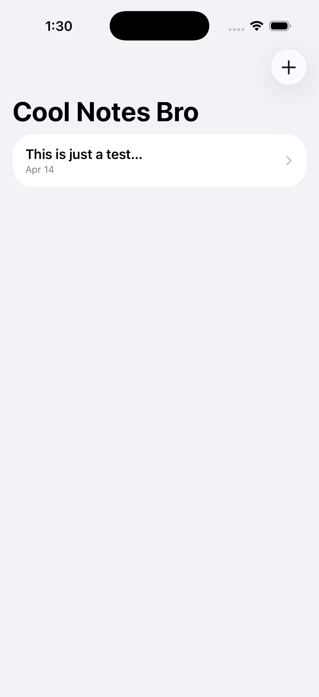

# Cool Notes Bro

A clean, fast note-taking app for iOS built with SwiftUI and SwiftData.

---

## Screenshots



---

## Features

- **Create & Edit Notes** — Tap `+` to create a new note; tap any note to edit the title and content
- **Swipe to Delete** — Remove notes with a standard swipe gesture
- **Persistent Storage** — Notes are saved automatically using SwiftData
- **Chronological Feed** — Notes are sorted newest-first so your latest thoughts are always on top
- **Category Support** _(in progress)_ — Data model supports organizing notes into categories

---

## Tech Stack

| Layer | Technology |
|---|---|
| Language | Swift 5.9+ |
| UI Framework | SwiftUI |
| Persistence | SwiftData |
| Minimum Target | iOS 17+ |
| Architecture | MVVM |

---

## Project Structure

```
Cool Notes Bro/
├── Main/
│   ├── Cool_Notes_BroApp.swift   # App entry point & SwiftData model container
│   ├── ContentView.swift         # Notes list with create/delete
│   └── Views/
│       └── EditNoteView.swift    # Note detail & editing
└── Data Model/
    └── Note.swift                # Note & Category SwiftData models
```

---

## Data Model

```swift
@Model
class Note {
    var title: String
    var content: String
    var timestamp: Date
    var category: Category?
}

@Model
class Category {
    var name: String
    @Relationship(deleteRule: .cascade) var notes: [Note]
}
```

---

## Requirements

- Xcode 15+
- iOS 17+
- Swift 5.9+

---

## Getting Started

1. Clone the repo
2. Open `Cool Notes Bro.xcodeproj` in Xcode
3. Select a simulator or device running iOS 17+
4. Build and run (`⌘R`)

---

## Roadmap

- [ ] Category management UI
- [ ] Search and filter
- [ ] Note sharing / export
- [ ] Markdown rendering

---

## License

MIT
